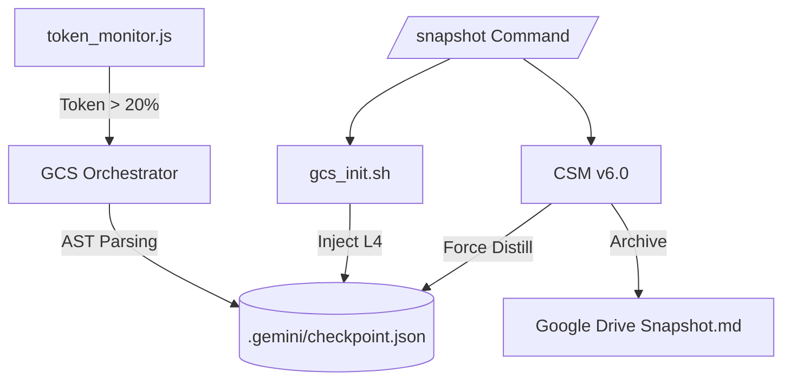

# Gemini CLI Unified Memory System V6.3.0: Autonomous "Universal Hybrid"

#2026-06-05
**Status**: 🛰️ Production Ready (V6.4.0 "Unified Snapshot Compaction")

## 📜 Change Log (變更紀錄)

| 版本 | 日期 | 變更說明 | 作者 |
| :--- | :--- | :--- | :--- |
| **V6.4.0** | 2026-06-05 | 1. **統一快照壓縮 (Unified Snapshot Compaction)**：取消原有的 Strategic Project Snapshot 模組，僅保留 Tactical Compaction 模組，並將對應的指令由 `/compact` 改為 `/snapshot`。 | Gemini CLI |
| **V6.3.0** | 2026-05-30 | 1. **階梯式增量蒸餾 (Incremental Distillation)**：導入 `DISTILL_TIERS`，將單一 20% 門檻升級為 20%, 30%, 40%, 50%, 60%, 70% 持續修剪。 2. 於 `gcs_orchestrator.py` 實作原子化階梯水位紀錄 (`gcs_watermark.json`)，避免閥值反覆觸發。 | Gemini CLI |
| **V6.2.0** | 2026-05-30 | 1. **世紀融合 (Universal Hybrid)**：吸收 Windows 專用版的 Bootstrap 顯式引導架構，於 `gemini-extension.json` 綁定 `python3 lib/bootstrap.py`。 2. 於 `bootstrap.py` 新增防禦性虛擬環境遺失降級引擎 (`sys.executable`) 與 stdin 非阻塞安全讀取。 3. 保有 `Module C (/scan2db)` 與 Tmux 即時狀態更新。 | Gemini CLI |
| **V6.0.1** | 2026-05-21 | 1. `token_monitor.js` 增加 10k token 冷卻機制。 2. 修正 osascript shell 轉義語法錯誤。 3. 加入正式 Change Log 區塊。 | Gemini CLI |
| **V6.0.0** | 2026-05-18 | 1. 整合 GCS Guardian 自動化治理框架。 2. 支援背景 YOLO 蒸餾與 Tmux 狀態顯示。 | Gemini CLI |
| **V5.4.3** | 2026-05-13 | 1. 引入 AST 級別代碼骨架化 (Skeletonization)。 2. 定義 6 層上下文治理架構。 | Gemini CLI |

## 1. Objectives & Vision
V6.0.0 marks the transition from manual context management to **Autonomous Context Governance**. By integrating the **GCS Guardian** framework, the system now provides real-time token monitoring, background AST-level distillation, and zero-touch session rehydration.

## 2. Core Architecture: Prefix-Invariant 6-Layer Layout
The 6-layer layout is now strictly enforced and managed by both background distillers and foreground orchestrators to maximize KV Cache hit rates.

| Layer | Name | Governance | Content Description |
| :--- | :--- | :--- | :--- |
| **L1** | **Core Mandates** | Fixed | System Mandates, Security Rules, GCS Governance Standards. |
| **L2** | **Skill Knowledge** | Static | Definitions of activated Agent Skills (e.g., CSM, Review) and Tools. |
| **L3** | **Project Manifest** | Dynamic | Project directory tree and environment context. |
| **L4** | **GCS Skeletons** | **Auto-Update** | **Zlib-compressed AST skeletons from `checkpoint.json`.** |
| **L5** | **Active Source** | FIFO | Full file contents involved in the current task (4096B aligned). |
| **L6** | **Ephemeral Context** | Real-time | Recent history, Git Diffs, and temporary tool outputs. |

## 3. Governance Pipeline

## 4. Components
- **GCS Distiller**: High-fidelity tree-sitter based engine for Python/JS/TS/TSX.
- **GCS Orchestrator**: Background manager with fcntl-based atomic locking.
- **LSP Bridge**: Semantic awareness for "Hot Symbol" preservation.
- **Token Monitor**: Hook-based real-time usage tracking (Gemini/Claude/OpenAI).
- **GCS Adapter**: Skill-level bridge for CSM to interact with the GCS core.

## 5. Thresholds & Mandates
- **Tiered Incremental Distillation**: Automatically triggers background AST distillation every 10% step starting at 20% (i.e. 20%, 30%, 40%, 50%, 60%, 70%) to ensure continuous context trimming without threshold thrashing.
- **80% (Critical Alert)**: Terminal banner alert for manual session reset.
- **Prefix Invariance**: Layout alignment is mandatory for all handoff files.
- **Security**: Mandatory secret scrubbing for high-entropy strings and credentials.

## 6. Visual Governance & UI Integration
To ensure high-visibility monitoring, the system integrates with the local development environment:

### 6.1. Tmux Status Bar Integration
The status bar provides real-time saturation metrics:
- **Location**: `status-right`, positioned between Task Indicators and the Clock.
- **Format**: `#[fg=cyan,bold][GCS: XX% (⚡ YOLO)]#[default]`.
- **Interval**: 5-second polling via `~/.gemini/gcs-guardian/tmux_status`.

### 6.2. macOS System Notifications
Critical thresholds trigger native OS alerts via `osascript`:
- **Trigger**: 20% Saturation.
- **Notification**: "🛰️ GCS Guardian | Context Saturation: XX% | Background distillation triggered".
- **Benefit**: Provides out-of-band awareness even when the terminal is not focused.

## 7. Troubleshooting & Critical Implementation Notes
To prevent regression during future deployments:
- **Hook Lifecycle Management**: 
    - **SessionStart**: `gcs_init.sh` MUST be placed in the `SessionStart` hook to ensure status is reset only at session launch.
    - **AfterModel**: `token_monitor.js` MUST be placed in the `AfterModel` hook for real-time tracking.
    - **Avoid BeforeModel**: Never place `gcs_init.sh` in `BeforeModel` as it causes a reset to 0% on every turn, hiding actual context usage.
- **Token Zero-Skip Logic**: `token_monitor.js` must skip updates when `promptTokenCount` is 0 (e.g., during tool calls or partial chunks) to prevent overwriting correct status data.
- **Absolute Paths**: Always use **absolute paths** for executable commands within hooks (e.g., `/opt/homebrew/bin/node` instead of just `node`) to avoid environment variable resolution issues.
- **Model Detection & Limits**: Explicitly check `llm_request.model` for accurate context limit assignment (1M for Flash, 2M for Pro).
- **Mandatory Restart**: Any change to `settings.json` or the Hook logic requires a **full restart** of the Gemini CLI process to take effect.

#csm #gcs #changelog #universal #hybrid #2026-06-05
