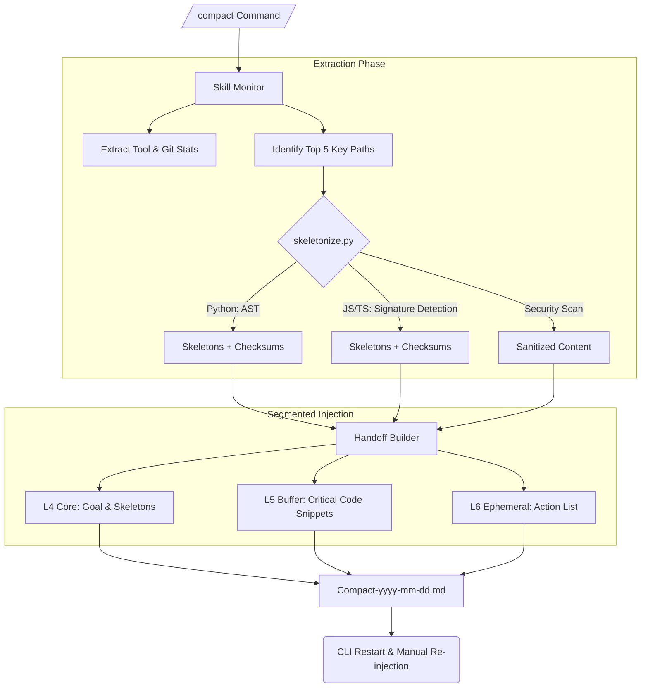

# Gemini CLI Unified Memory System V5.4.3: High-Fidelity Skeletonization & 6-Layer Context Governance

#2026-05-13
**Status**: 🚀 Ready for Implementation (V5.4.3 "3.1 Pro" Standard)

## 1. Objectives & Vision
V5.4.3 addresses the "Structural Blindness" issue after manual handoffs in V5.3. By introducing AST-level Code Skeletonization and a **6-Layer Context Governance Architecture**, we significantly improve the quality of understanding after session restarts and optimize token efficiency and KV Cache hit rates.

## 2. Core Architecture: Prefix-Invariant 6-Layer Layout
To ensure the Agent enters the correct state as quickly as possible after a restart, we use the following hierarchy to arrange the context, ensuring stability and attention weighting:

| Layer | Name | Characteristics | Content Description |
| :--- | :--- | :--- | :--- |
| **L1** | **Core Mandates** | Fixed | System Mandates, Security Rules, GCS Governance Standards. |
| **L2** | **Skill Knowledge** | Static | Definitions of activated Agent Skills (e.g., TDD, Review) and their Tools. |
| **L3** | **Project Manifest** | Dynamic | Project directory tree generated by `list_directory` and environment variables. |
| **L4** | **Handoff Skeletons** | **Core Layer** | **AST-derived code skeletons from V5.4.3 (Module A).** |
| **L5** | **Active Source** | FIFO | Full file contents involved in the current task (subject to Quota). |
| **L6** | **Ephemeral Context** | Real-time | Recent 3 turns of history, Git Diffs, and temporary tool outputs. |

## 3. System Flow (The Essence Pipeline)



## 4. Code Structure Preview

```text
custom-session-manager/
├── SKILL.md                 # Module A with 6-layer layout logic
├── README.md                # V5.4.3 Setup Instructions
├── DESIGN_SPEC.md           # This English Architecture Specification
├── commands/
│   ├── compact.toml         # Trigger for Module A (Tactical Compaction)
│   ├── snapshot.toml        # Trigger for Module B (Strategic Snapshot)
│   └── scan2db.toml         # Trigger for Module C (Memory Sync)
└── lib/
    ├── skeletonize.py       # Core AST Skeleton Extraction Engine
    ├── sanitizers.py        # Regex Secret Redaction Logic
    └── quota_manager.py     # Token Counting & Smart Truncation Logic
```

## 5. Technical Specifications

### 5.1. Advanced Skeletonization Engine (`skeletonize.py`)
- **Python**: Use `ast` module for 100% structural fidelity.
- **JS/TS**: Context-aware signature detection (handles async, arrow, and templates).
- **Retention**: Preserve Decorators, first paragraph of Docstrings, and Import blocks.
- **Depth Control**: Default recursion depth = 2 layers.

### 5.2. Security & Sanitization
- **Secret Scanner**: Detection of high-entropy strings (e.g., `AIza...`).
- **Redaction**: Replaces suspected secrets with `[REDACTED]`.

### 5.3. Smart Quota & Attention Management
- **Global Quota**: Target handoff summary < 3000 Tokens.
- **Per-file Limit**: Max 600 Tokens; auto-hides private methods (`_method`) if exceeded.
- **Segmented Injection**: Follows L1-L6 layout to ensure "Goal" and "Skeletons" are in high-attention zones.

## 6. Trust & Verification Protocol
- **Timestamp Guard**: Records file `mtime` to detect external modifications (Ghost Interfaces).
- **Integrity Verification**: Includes the SHA-256 hash of the full file in the skeleton header.
- **Fail-back**: If the Agent fails based on the skeleton, it is mandated to `read_file` the full content.

---
#gemini-cli #memory-system #architecture #v5-4-3 #skeletonization #3.1pro #2026-05-13
