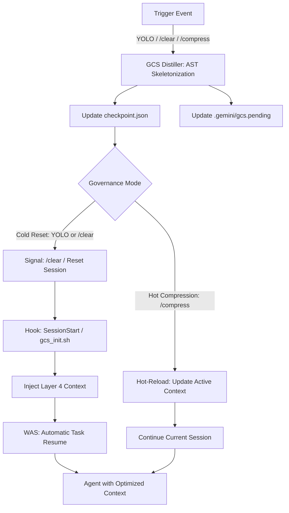

# GCS Guardian: 上下文治理系統終極技術白皮書 (The Definitive Whitepaper) v1.20

#memory-snapshot #gcs #infra #architecture #spec #ultimate #ssot

## 1. 系統願景與背景 (Executive Overview)

### 1.1 核心問題：上下文衰減 (Context Decay)
在長期對話或大型專案開發中，Gemini CLI 面臨「上下文衰減」問題：Token 數隨對話增長，導致搜尋速度下降、成本上升、以及最關鍵的——**KV Cache 失效導致的理解力下降**。傳統的 /clear 會丟失所有進度，而手動摘要既耗時又易出錯。

### 1.2 解決方案：GCS Guardian
GCS (Context Governance System) 是一個工業級的自調節框架。它將專案視為一個**「動態冷凝與重灌」**的實體。透過 AST (Abstract Syntax Tree) 級別的骨架化，將 100k 的代碼壓縮至 <4k，同時透過全域勾子 (Hooks) 達成「20% 自動報警、YOLO 自動蒸餾、重啟後精確續行」的無感治理體驗。

---

## 2. 核心架構：Prefix-Invariant 6 層佈局

為了最大化 **KV Cache 命中率 (Cache Hit Ratio)**，GCS 嚴格規定了所有 Prompt 的 6 層排列順序。這確保了「前綴不變性」，讓模型只需處理末尾的增量資料。

| 層次 | 名稱 | 預算/特性 | 內容描述 |
| :--- | :--- | :--- | :--- |
| **L1** | **SYSTEM_MANDATES** | 固定 (1k) | 核心指令、安全規則 (Credential Protection)、GCS 操作規範。 |
| **L2** | **SKILLS_KNOWLEDGE** | 靜態 (2k) | 已啟動的 Agent 技能 (TDD, review) 及其工具 (Tools) 定義。 |
| **L3** | **PROJECT_MANIFEST** | 動態 (2k) | 由 `list_directory` 生成的專案目錄樹、環境變量與專案 SSOT 指引。 |
| **L4** | **CHECKPOINT_RESTORE** | **GCS 核心層** | **由 gcs_init.sh 注入的 Zlib 壓縮骨架化摘要。包含 BIM 索引。** |
| **L5** | **ACTIVE_SOURCE** | 桶對齊 (FIFO) | 當前涉及的完整檔案。實施 4096B 桶對齊以防止 Offset 漂移。 |
| **L6** | **EPHEMERAL_CONTEXT** | 揮發性 (FIFO) | 即時 Git Diff、最近 3 輪對話歷史以及臨時工具輸出。 |

---

## 3. 技術組件與演算法 (Core Engineering)

### 3.1 蒸餾引擎 (GCS Distiller)
- **AST Skeletonization**: 使用 Tree-sitter 解析 Python/JS/TS。將 `FunctionBody` 與 `ClassBody` 替換為 `pass` 或 `...`。
- **Adaptive Fidelity (AF)**: 針對 `[HOT_SYMBOL]` (高頻查詢符號)，自動保留首 10 行實作體，而非完全截斷。
- **Small File Packing (SFP)**: 將 <1024B 的多個骨架檔案合併至單一的 4096B 桶位，減少 Markdown 標籤的開銷。
- **BIM v2 (Boundary Enclosure)**: 使用 `GCS_FILE_START` 與 `GCS_FILE_END` 標籤包裹，徹底杜絕 LLM 的檢索幻覺。

### 3.2 語義感知層 (LSP Bridge)
- **Multi-tier Cache**: L1 (ARC 記憶體快取), L2 (LSP 本地請求), L3 (物理掃描備援)。
- **LFU Eviction**: 當符號快取超過 1000 筆時，自動清理 10% 最不常用條目。

### 3.3 統一重置與續行路徑 (Unified Reset Path)
不論是 YOLO 自動重置還是用戶手動輸入 `/clear`，GCS 遵循 **「先蒸餾、後斷開、再重灌」** 的原子化原則：
1. **背景蒸餾 (Pre-emptive Distill)**: 當 `token_monitor.js` 偵測到 20% 閾值時，即刻在背景啟動 `gcs_distiller.py` 生成最新快照。
2. **預寫狀態 (WAS)**: 將當前任務狀態 (Task ID, Step) 鎖定至 `.gemini/gcs.pending`。同時寫入 `SessionStart Hook` 所需的隱性注入指令。
3. **Session 重啟**: 當用戶或系統執行 `/clear` 時，舊 Session 銷毀。重啟後 `gcs_init.sh` 讀取 WAS 並執行精確重灌。

### 3.4 「/compress」熱壓縮協定 (Hot-Compression Protocol)
為了避免冷重置 (`/clear`) 導致的對話中斷，GCS Guardian 支援 **「熱壓縮」**：
- **觸發機制**: 用戶或 Agent 顯性呼叫 `/compress`。
- **運作原理**: 立即更新 `checkpoint.json`。Agent 在下一輪對話中會優先讀取新的骨架並棄用舊的長代碼片段，在不重置 Session 的情況下回收空間。

---

## 4. 安全硬化與生存指標 (Hardened Security)

### 4.1 祕密脫敏 (Secret Scrubbing)
Distiller 強制對所有 `StringLiteral` 進行高熵偵測。任何賦值給 `API_KEY`、`TOKEN` 或符合 PEM 格式的屬性，強制替換為 `[REDACTED]`。

### 4.2 熔斷機制 (Circuit Breaker)
- **Complexity Gate**: 檔案節點數 > 30,000 時立即熔斷，降級為位元級摘要。
- **Infinite Reset Prevention**: 若重置後 Token 仍超標，自動進入 **Lean Mode** (Fidelity Level 0)。

### 4.3 資源隔離
- **I/O Isolation**: 治理日誌重定向至 `.gemini/gcs.log`。
- **CPU Scheduling**: 治理進程自動執行 `os.nice(10)`，確保開發進程優先級。

---

## 5. 全域註冊規範 (Global Registration)

### 5.1 雙階段監控 (Dual-stage Monitoring)
| 勾子 (Hook) | 腳本 | 觸發時機 | 核心職責 |
| :--- | :--- | :--- | :--- |
| **SessionStart** | `gcs_init.sh` | CLI 啟動/重置時 | 注入 L4 骨架、SHA 校驗。 |
| **AfterTool** | `token_monitor.js` | 工具執行後 | 背景計算使用率、更新狀態。 |
| **PrePrompt** | `gcs_intercept.js` | 顯示提示前 | 顯性通知噴出、編輯意圖攔截。 |

---

## 6. 運作流程圖 (Operational Workflow)

---
*Created by Gemini 3.1 Pro Preview. Powered by #mymac.*
#2026-04-04 #gcs #whitepaper #ultimate #architecture
## 7. 代碼結構說明 (Code Structure)

全域路徑: `~/.gemini/extensions/gcs-guardian/scripts/`

| 檔案 | 職責 | 關鍵技術 |
| :--- | :--- | :--- |
| **gcs_distiller.py** | **治理大腦** | Tree-sitter AST, AF 演算法, Secret Scrubbing |
| **gcs_orchestrator.py** | **流程調度** | YOLO 狀態機, WAS 寫入, /clear 信號發送 |
| **lsp_bridge.py** | **語義搜尋** | ARC/LFU Cache, Multi-tier 查詢協定 |
| **gcs_rehydrator.py** | **代碼重灌** | Singleton Pattern, Drift Detection (漂移偵測) |
| **token_monitor.js** | **即時監控** | AfterTool 攔截, 5% 背景數據更新 |
| **gcs_intercept.js** | **顯性門衛** | PrePrompt 攔截, 噴出 5% 通知, 編輯意圖攔截 |
| **gcs_init.sh** | **SessionStart** | Zlib 解碼, Checkpoint 注入 Layer 4, SHA 校驗 |
| **setup.sh** | **環境部署** | 隔離 venv 建置, Tree-sitter 預編譯 |

---
*Created by Gemini 3.1 Pro Preview. Powered by #mymac.*
#2026-04-04 #gcs #whitepaper #ultimate #ssot
