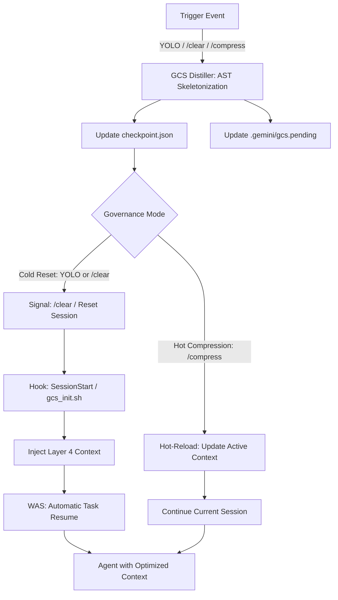

# GCS Guardian: 上下文治理系統終極技術白皮書 (The Definitive Whitepaper) v1.22.0

#2026-05-17 #gcs #infra #architecture #spec #ultimate #ssot #token-counting

## 1. 系統願景與背景 (Executive Overview)

### 1.1 核心問題：上下文衰減 (Context Decay)
在長期對話或大型專案開發中，Gemini CLI 面臨「上下文衰減」問題：Token 數隨對話增長，導致搜尋速度下降、成本上升、以及最關鍵的——**KV Cache 失效導致的理解力下降**。傳統的 /clear 會丟失所有進度，而手動摘要既耗時又易出錯。

### 1.2 解決方案：GCS Guardian
GCS (Context Governance System) 是一個工業級的自調節框架。它將專案視為一個**「動態冷凝與重灌」**的實體。透過 AST (Abstract Syntax Tree) 級別的骨架化，將 100k 的代碼壓縮至 <4k，同時透過全域勾子 (Hooks) 達成「閾值自動報警、YOLO 自動蒸餾、精確 token 監控、重啟後精確續行」的無感治理體驗。

---

## 2. 核心架構：Prefix-Invariant 6 層佈局

為了最大化 **KV Cache 命中率 (Cache Hit Ratio)**，GCS 規定了所有 Prompt 的 6 層排列順序。這確保了「前綴不變性」，讓模型只需處理末尾的增量資料。

| 層次     | 名稱                     | 預算/特性       | 內容描述                                          |
| :----- | :--------------------- | :---------- | :-------------------------------------------- |
| **L1** | **SYSTEM_MANDATES**    | 固定 (1k)     | 核心指令、安全規則 (Credential Protection)、GCS 操作規範。   |
| **L2** | **SKILLS_KNOWLEDGE**   | 靜態 (2k)     | 已啟動的 Agent 技能 (TDD, review) 及其工具 (Tools) 定義。  |
| **L3** | **PROJECT_MANIFEST**   | 動態 (2k)     | 由 `list_directory` 生成的專案目錄樹、環境變量與專案 SSOT 指引。  |
| **L4** | **CHECKPOINT_RESTORE** | **GCS 核心層** | **由 gcs_init.sh 注入的 Zlib 壓縮骨架化摘要。包含 BIM 索引。** |
| **L5** | **ACTIVE_SOURCE**      | 桶對齊 (FIFO)  | 當前涉及的完整檔案。實施 4096B 桶對齊以防止 Offset 漂移。          |
| **L6** | **EPHEMERAL_CONTEXT**  | 揮發性 (FIFO)  | 即時 Git Diff、最近 3 輪對話歷史以及臨時工具輸出。               |

---

## 3. 技術組件與演算法 (Core Engineering)

### 3.1 蒸餾引擎 (GCS Distiller)
- **AST Skeletonization**: 使用 Tree-sitter 解析 Python/JS/TS。將 `FunctionBody` 與 `ClassBody` 替換為 `pass` 或 `...`。
- **Adaptive Fidelity (AF)**: 針對 `[HOT_SYMBOL]` (高頻查詢符號)，自動保留首 10 行實作體，而非完全截斷。
- **Small File Packing (SFP)**: 將 <1024B 的多個骨架檔案合併至單一的 4096B 桶位，減少 Markdown 標籤的開銷。

### 3.2 精度 Token 監控與視效連動 (Precision Monitoring & Tmux Integration)
*(註：本節於 v1.22.0 根據最新研究成果重構)*

為了精確計算 Context 飽和度，GCS 放棄了對 `AfterTool` 的模糊估算，全面轉向 **API 級別的 `AfterModel` 監控**：
- **核心指標**: 採用 **`promptTokenCount`** 而非 `totalTokenCount`。
    - `promptTokenCount`：包含整個對話歷史、System Prompt 與 Tools 定義，這才是真正佔用 Context Window 空間的數據。
    - **跨模型相容性 (Cross-Model Compatibility)**：動態解析 Gemini 的 `usageMetadata.promptTokenCount` 以及 Claude/OpenAI 系列的 `usage.input_tokens`，確保在各種模型下皆能精確計算，避免讀不到 Token 而靜默失效的問題。
- **Tmux 實時視效與狀態機**:
    - **狀態重置**：`SessionStart` (`gcs_init.sh`) 在啟動或 `/clear` 時，強制無條件將狀態覆寫回 `[GCS: 0%]`。
    - **輕量狀態檔**：即時百分比寫入全域檔案 `~/.gemini/gcs-guardian/tmux_status`，供 `.tmux.conf` 內的 `status-right` 高頻讀取 (無效能開銷)。
    - **視覺橫幅警報**：當 20% 觸發 YOLO 背景蒸餾時，以及蒸餾完成時，透過 `tmux display-message` 全域推播提醒字卡。

### 3.3 統一重置與續行路徑 (Unified Reset Path)
不論是 YOLO 自動重置還是用戶手動輸入 `/clear`，GCS 遵循 **「先蒸餾、後斷開、再重灌」** 的原子化原則：
1. **背景蒸餾 (Pre-emptive Distill)**: 當 `token_monitor.js` 偵測到 20% 閾值時，即刻在背景啟動 `gcs_orchestrator.py` 生成最新快照。
2. **預寫狀態 (WAS)**: 將當前任務狀態 (Task ID, Step) 鎖定至 `.gemini/gcs.pending`。
3. **Session 重啟**: 當執行 `/clear` 時，舊 Session 銷毀。重啟後 `gcs_init.sh` 讀取 WAS 並執行 Layer 4 骨架注入。

---

## 4. 安全硬化與生存指標 (Hardened Security)

### 4.1 祕密脫敏 (Secret Scrubbing)
Distiller 強制對所有 `StringLiteral` 進行模式與高熵偵測。任何賦值給 `API_KEY`、`TOKEN` 或符合 PEM 格式的屬性，強制替換為 `[REDACTED]`。

### 4.2 熔斷機制 (Circuit Breaker)
- **Complexity Gate**: 檔案節點數 > 30,000 時立即熔斷，降級為位元級摘要。
- **Infinite Reset Prevention (Lean Mode)**: 若骨架化後 Token 仍超標，自動進入 **Lean Mode** (Fidelity Level 0)，僅保留路徑。

---

## 5. 全域註冊規範 (Global Registration)

### 5.1 治理勾子表 (Governance Hooks)
| 勾子 (Hook)        | 腳本                 | 觸發時機       | 核心職責 (v1.22.0 更新)      |
| :--------------- | :----------------- | :--------- | :----------------------- |
| **SessionStart** | `gcs_init.sh`      | 啟動/重置時 | 注入 L4 骨架、無條件將 tmux 狀態重置為 `[GCS: 0%]`。 |
| **AfterModel**   | **`token_monitor.js`** | **模型回覆後** | **API 級 Token 計數與背景 YOLO 觸發。因 CLI 模組載入限制，此勾子必須綁定在全域 `~/.gemini/settings.json` 並帶有 `matcher: "*"` 才能生效。** |
| **PrePrompt**    | `(已廢棄)` | 提示前      | *(原 `gcs_intercept.js` 攔截器已因改用 AfterModel 而正式廢棄)* |

### 5.2 AfterModel 掛載設定詳解 (Hook Binding Details)

由於 Gemini CLI 的底層模組載入機制限制，模型等級 (Model-Level) 的 Hook（如 `AfterModel`）若放置於擴充模組的 `extension.json` 中將會被靜默忽略。為了確保能精確攔截封包並取得 API 級別的 Token 數據，**必須將該 Hook 直接註冊於使用者的全域設定檔 `~/.gemini/settings.json` 中**，且必須嚴格遵守 `matcher: "*"` 的陣列包裝結構。

請確保您的 `~/.gemini/settings.json` 包含以下結構：

```json
{
  "hooks": {
    "AfterModel": [
      {
        "matcher": "*",
        "hooks": [
          {
            "name": "gcs-token-monitor",
            "type": "command",
            "command": "node /Users/yj/.gemini/extensions/gcs-guardian/scripts/token_monitor.js"
          }
        ]
      }
    ]
  }
}
```

> [!WARNING] 結構陷阱警告
> 雖然 Gemini CLI 官方文件指出 `AfterModel` 不需使用 `matcher`，但實務上其配置解析器強制要求了這一層結構。若省略 `"matcher": "*"` 直接宣告指令，將導致 Hook 徹底失效且沒有任何錯誤提示（靜默失敗），請務必遵循上述精確的 JSON 結構。

---

## 6. 運作流程圖 (Operational Workflow)



---

## 7. 代碼結構說明 (Code Structure)

| 模組/檔案 | 職責 | 關鍵技術 |
| :--- | :--- | :--- |
| **src/gcs/config.py** | **設定 SSOT** | 2k/20% 閾值與路徑管理 |
| **src/gcs/gcs_distiller.py** | **治理大腦** | Tree-sitter, Secret Scrubbing |
| **hooks/token_monitor.js**| **API 級監控** | **AfterModel 攔截, promptTokenCount 計算** |
| **hooks/gcs_init.sh** | **SessionStart**| Checkpoint 注入 Layer 4 |

---
*Verified by Gemini 3.1 Pro Code Review. Status: PRODUCTION READY.*
#2026-05-17 #gcs #whitepaper #ultimate #ssot
