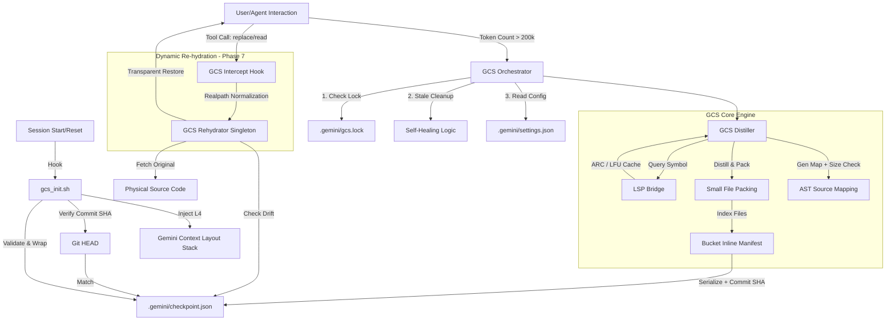

# GCS (Context Governance System) Comprehensive Design Spec v1.14

## 1. 系統願景 (Executive Summary)
Gemini CLI 上下文治理系統 (GCS) 是一個工業級的自調節框架，旨在解決大型軟體專案開發中的「上下文衰減」問題。透過 AST 級別的骨架化冷凝、物理級的桶對齊、分級 LSP 語義感知以及「動態回填」技術，GCS 確保了在 **200k (20%) Token 治理閾值**下仍能維持極高的開發保真度與快取穩定性。v1.14 進一步引入了漂移偵測與路徑實體化防護，達成了生產環境的穩健性。

---

## 2. 系統架構圖 (System Architecture)

### 2.1 全量數據流與閉環機制


### 2.2 上下文分層佈局 (Layered Layout Stack)
GCS 採用嚴格的 **Prefix-Safe** 6 層佈局，確保 KV Cache 的最大化複用：

1. **[L1] SYSTEM_MANDATES (絕對不變)**: 包含核心安全規則、Credential 保護協定與 GCS 操作指令規範。
2. **[L2] SKILLS_KNOWLEDGE (靜態)**: 已啟動的 Agent 技能（如 TDD, code-reviewer）及其工具定義。
3. **[L3] PROJECT_MANIFEST (低頻變動)**: 由 `list_directory` 生成的 2k 預算目錄樹、環境變量與專案 SSOT 指引。
4. **[L4] CHECKPOINT_RESTORE (恢復層)**: 由 `gcs_init.sh` 注入的骨架化摘要。包含 BIM 索引、Adaptive Fidelity 代碼與 Source Map 錨點。
5. **[L5] ACTIVE_SOURCE (對齊追加區)**: 當前對話涉及的完整代碼檔案。實施 **4096B 桶對齊** 與 **64B Hysteresis Slack** 以防止 Offset 漂移。
6. **[L6] EPHEMERAL_CONTEXT (FIFO)**: 即時 Git Diff、最近 3 輪對話歷史以及臨時工具輸出。

---

## 3. 核心技術組件詳解

### 3.1 蒸餾引擎 (GCS Distiller)
- **AST Skeletonization**: 使用 Tree-sitter 對 Python/JS/TS 進行語法解析。將所有函數/類別主體 (Body) 替換為 `pass` 或 `...`。
- **Adaptive Fidelity (AF)**: 
    - 針對 `[HOT_SYMBOL]`（由 ARC 識別），自動保留首 10 行實作體。
    - 始終保留 `Imports` 與 `Decorators` 以維持語義連貫性。
- **Small File Packing (SFP)**: 將小於 1024 位元組的骨架檔案合併至單一的 4096B 桶位 (`COMMON_BUCKET_N`)。
- **BIM v2 (Boundary Enclosure)**: 使用 `GCS_FILE_START` 與 `GCS_FILE_END` 標籤並配合 Markdown 語法高亮，徹底杜絕 LLM 的檢索幻覺。

### 3.2 語義感知層 (LSP Bridge)
- **Multi-tier Response**: L1 (Cache), L2 (200ms LSP), L3 (Fallback)。
- **Active Reference Counting (ARC)**: 統計符號被查詢的頻率。若 `count > 5`，則標註為 `HOT_SYMBOL`。
- **LFU Eviction**: 當快取超過 1000 條目時，採用快照排序機制自動清理 10% 最不常用符號，確保記憶體安全。

### 3.3 動態回填與穩健性 (Phase 7 Robustness)
- **AST Source Mapping**: 紀錄符號的位元偏移量與蒸餾時的 `file_size_at_distill`。
- **Drift Detection**: 回填前校驗物理檔案大小。若偵測到外部編輯導致的大小改變，系統將主動拒絕回填以防止提供錯誤片段。
- **Realpath Normalization**: 所有路徑解析統一使用 `realpath`，解決軟連結 (Symlinks) 環境下的攔截失效風險。
- **Encoding Safety**: 使用 `errors="replace"` 處理 UTF-8 以外的 Legacy 編碼檔案，確保系統不因編碼異常而崩潰。

---

## 4. 代碼結構與職責 (Code Structure)

```text
src/gcs/
├── gcs_distiller.py    # 實作 AST 蒸餾、AF 自適應保真、SFP 打包與 Source Map 錄製
├── lsp_bridge.py       # 實作分級 LSP 請求、LFU 快取淘汰與進程自癒 (Mutex Protected)
├── gcs_orchestrator.py # 實作自動熔斷、並發鎖、分支感知清理 (Commit SHA Verify)
├── gcs_rehydrator.py   # 實作具備單例緩存 (Singleton) 與漂移偵測的原始碼回填引擎
├── gcs_intercept.py    # 實作基於實體路徑 (Realpath) 的工具級調用攔截勾子
├── gcs_health_report.py# 實作具備 git ls-files 效能的全量掃描報表
├── sst_bench.py        # 提供高精度 (perf_counter) 的效能量測工具
└── gcs_init.sh         # 具備 jq 驗證與 SHA 比對的安全恢復勾子
```

---

## 5. 關鍵技術指標 (KPIs)
- **Cache Hit Ratio**: 目標命中率 > 95%。
- **Drift Resilience**: 100% 偵測檔案大小改變導致的偏移失效。
- **Concurrency Safety**: 透過 Mutex 與 Singleton 確保多工具併發時的數據一致性。
- **Semantic Fidelity**: 核心代碼在 90% 壓縮率下仍維持高度可讀性。

---

## 6. 文檔規範 (Documentation Standard)
- **Hashtag Mandate**: 所有 `.md` 檔案必須包含 `#yyyy-mm-dd` 與主題標籤（如 `#gcs #architecture`）。
- **Prefix Invariance**: 確保所有文檔在注入時維持 Layered Layout Stack 的順序。

-e 

#2026-04-04 #gcs #architecture #spec
