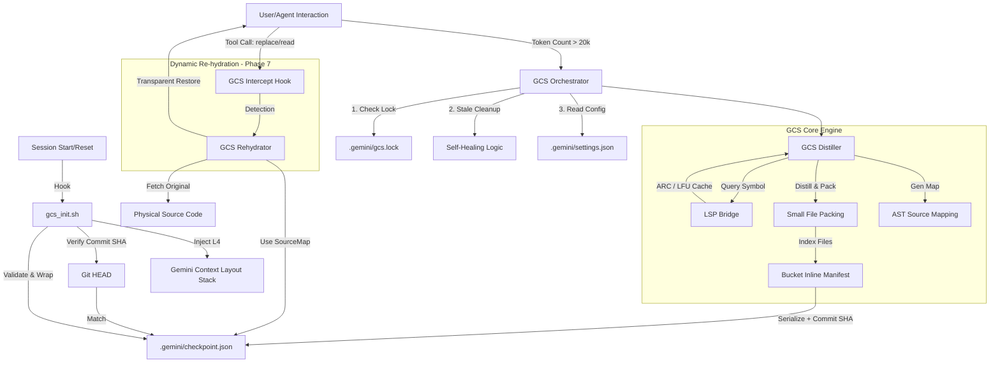

# GCS (Context Governance System) Comprehensive Design Spec v1.13

## 1. 系統願景 (Executive Summary)
Gemini CLI 上下文治理系統 (GCS) 是一個工業級的自調節框架，旨在解決大型軟體專案開發中的「上下文衰減」問題。透過 AST 級別的骨架化冷凝、物理級的桶對齊對齊、分級 LSP 語義感知以及最新的「動態回填」技術，GCS 確保了在 20k Token 限制下仍能維持極高的開發保真度與快取穩定性。

---

## 2. 系統架構圖 (System Architecture)

### 2.1 全量數據流與閉環機制


### 2.2 上下文分層佈局 (Layered Layout Stack)
GCS 採用嚴格的 **Prefix-Safe** 6 層佈局，確保 KV Cache 的最大化複用：

1. **[L1] SYSTEM_MANDATES (絕對不變)**: 包含核心安全規則、Credential 保護協定與 GCS 操作指令規範。
2. **[L2] SKILLS_KNOWLEDGE (靜態)**: 已啟動的 Agent 技能（如 TDD, code-reviewer）及其工具定義。
3. **[L3] PROJECT_MANIFEST (低頻變動)**: 由 `list_directory` 生成的 2k 預算目錄樹、環境變量與專案 SSOT 指引。
4. **[L4] CHECKPOINT_RESTORE (恢復層)**: 由 `gcs_init.sh` 注入的骨架化摘要。包含 BIM 索引、Adaptive Fidelity 代碼與 Source Map 錨點。
5. **[L5] ACTIVE_SOURCE (對齊追加區)**: 當前對話涉及的完整代碼檔案。實施 **4096B 桶對齊** 與 **64B Hysteresis Slack** 以防止 Offset 漂移。
6. **[L6] EPHEMERAL_CONTEXT (FIFO)**: 即時 Git Diff、最近 3 輪對話歷史以及臨時工具輸出。

---

## 3. 核心技術組件詳解

### 3.1 蒸餾引擎 (GCS Distiller)
- **AST Skeletonization**: 使用 Tree-sitter 對 Python/JS/TS 進行語法解析。將所有函數/類別主體 (Body) 替換為 `pass` 或 `...`。
- **Adaptive Fidelity (AF)**: 
    - 針對 `[HOT_SYMBOL]`（由 ARC 識別），自動保留首 10 行實作體。
    - 始終保留 `Imports` 與 `Decorators` 以維持語義連貫性。
- **Small File Packing (SFP)**: 將小於 1024 位元組的骨架檔案合併至單一的 4096B 桶位 (`COMMON_BUCKET_N`)。
- **Bucket Inline Manifest (BIM) v2**: 在打包桶中使用 `GCS_FILE_START` 與 `GCS_FILE_END` 標籤，並輔以 Markdown 語法高亮，強化 LLM 的物理邊界感知。

### 3.2 語義感知層 (LSP Bridge)
- **Multi-tier Response**: 
    - L1: 符號快取（立即）。
    - L2: 200ms 內的 LSP 定義查詢。
    - L3: 非同步回退。
- **Active Reference Counting (ARC)**: 統計符號被查詢的頻率。若 `count > 5`，則升級為 `HOT_SYMBOL` 並觸發 AF。
- **LFU Eviction**: 當快取超過 1000 條目時，採用快照排序機制自動清理 10% 最不常用符號。

### 3.3 自動化協調器 (Orchestrator)
- **20k Token 熔斷**: 自動監控並在觸發點執行背景蒸餾。
- **並發鎖防護**: 使用 `fcntl.flock` 防止多程序數據競爭。
- **分支感知 (Branch-Aware)**: 在 Checkpoint 中嵌入 `commit_sha`。啟動時驗證 SHA，若分支切換則強制快取失效，杜絕「幽靈上下文」。

### 3.4 動態回填 (Dynamic Re-hydration - Phase 7)
- **Source Mapping**: 紀錄符號的 `original_start` 與 `original_end` 位元偏移量。
- **Tool Interception**: 攔截工具請求（如 `replace`），若目標檔案被骨架化，則自動從磁碟抓取原始碼進行透明回填。

---

## 4. 代碼結構與職責 (Code Structure)

```text
src/gcs/
├── gcs_distiller.py    # 實作 AST 蒸餾、AF 自適應保真、SFP 打包與 BIM 索引
├── lsp_bridge.py       # 實作分級 LSP 請求、LFU 快取淘汰與進程自癒
├── gcs_orchestrator.py # 實作自動熔斷、並發鎖、分支感知清理與原子持久化
├── gcs_rehydrator.py   # [P7] 實作回填邏輯
├── gcs_intercept.py    # [P7] 實作工具攔截勾子
├── gcs_health_report.py# 實作具備 git ls-files 效能的全量掃描報表
├── sst_bench.py        # 提供高精度 (perf_counter) 的效能量測工具
└── gcs_init.sh         # 具備 jq 驗證與 SHA 比對的安全恢復勾子
```

---

## 5. 關鍵技術指標 (KPIs)
- **Cache Hit Ratio**: 透過 4096B 桶對齊與 64B Slack，目標快取命中率 > 95%。
- **Compression Efficiency**: 針對大型原始碼倉庫達成 > 90% 的 Context 節省。
- **Response Latency**: 單一檔案骨架化 < 10ms，全專案 (500+ Files) 蒸餾 < 500ms。
- **Semantic Fidelity**: AF 與 ARC 機制確保 Agent 在極限壓縮下不遺失核心邏輯判斷。
-e 

#2026-04-04
